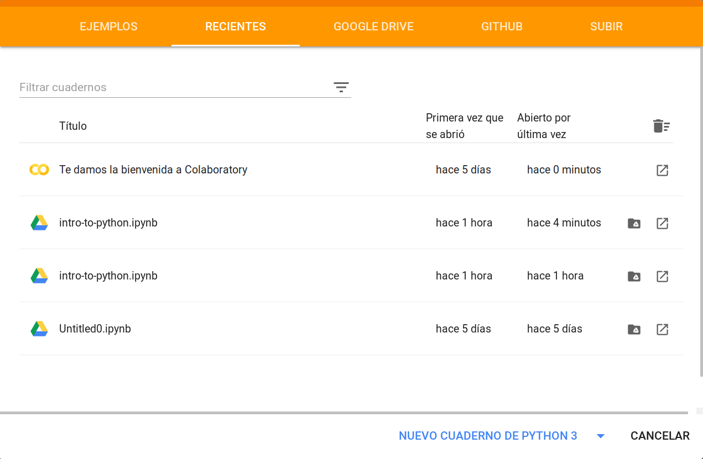
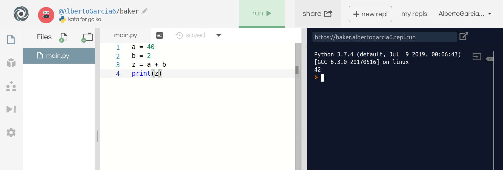
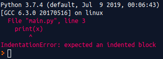

# Manual de la prueba de acceso para el Bootcamp de Data Analytics de Ironhack

## Propósito de este documento

Con este documento pretendemos darte una ayuda para que pases la prueba técnica de acceso al bootcamp de Ironhack en análisis de datos y sepas a lo que te vas a enfrentar. Consistirá principalmente en resolver un problema básico de programación en Python. Los conceptos estadísticos necesarios serán mínimos.

Contiene tres secciones: 
* **Programación online**: para que practiques fácilmente tus códigos. 
* **Conocimientos de Python**: para mostrarte los conocimientos mínimos con ejemplos. 
* **Ejemplo de prueba de acceso**: para que lo resuelvas y nos envíes tu solución. 

## Programación online

Para programar sin tener que instalarte ningún software hazte una cuenta en [repl](https://repl.it/repls). Podrás practicar todo lo que quieras en Python y en muchos otros lenguajes de programación. Intenta probar todo lo que se muestra en este documento, incluido el ejemplo de prueba de acceso.

Otra opción es usar un notebook de Python3 en [colab](https://colab.research.google.com), de Google. 

### 1. Colab de Google

https://colab.research.google.com



Debes seleccionar la opción `Nuevo cuarderno de python 3` empezar a programar. 


### 2. Repl

https://repl.it/repls

Sólo debes poner código en la sección blanca y darle al botón verde <span style="color:green">**RUN**</span>.

 

## Conocimientos de Python

Durante la prueba te pediremos que apliques algunos de los conceptos de esta sección. Los imprescidibles son: listas, bucles y condicionales. 

### Salida
Para mostrar por pantalla un mensaje. 
```python
print("Hello World")
```

### Variables
Para asignar valores a variables. 
```python
# cadena de caracteres
mensaje = "Hello World"
print(mensaje)

# número entero
a = 40
b = 2
z = a + b
print(z)
```

### Haciendo cálculos
Python es una calculadora supervitaminada. 
```python
# cálculos
suma = 39 + 3
resta = 15 - 13
multiplicacion = 12 * 2
division = 7 / 3
division_entera = 7 // 3
modulo = 7 % 3

# outputs
print(suma)
print(resta)
print(multiplicacion)
print(division)
print(division_entera)
print(modulo)
```

### Entrada
Para escribir con el teclado y que la máquina lo almacene. Luego podremos usarlo y mostrarlo por pantalla si queremos. 
```python
nombre = input("Escribe tu nombre: ")
print("Hola", nombre, "!")
```

### Tipos de datos
Para ver el tipo de variable que estamos usando: entero, número con decimales, cadena de caracteres, lista, etc. 
```python
# cadena de caracteres
cadena = "Esto es una cadena de caracteres"
tipo_cadena = type(cadena)
print(tipo_cadena)

# número entero
entero = 42
tipo_entero = type(entero)
print(tipo_entero)

# número con decimales
flotante = 42.42
tipo_flotante = type(flotante)
print(tipo_flotante)

# lista
lista = [1,2,3,4,5,1,2,3,4,5]
tipo_lista = type(lista)
print(tipo_lista)
```

### Contar e indexar
Para ver la longitud de algo que se pueda recorrer: lista, cadena de caracteres, tupla, diccionario, etc.
Para seleccionar un elemento por su índice
```python
hechizo = "expeliarmus"

print(len(hechizo))
print(hechizo[0])
print(hechizo[1])
print(hechizo[-1])
```

### Listas
La salsa de python. Las listas no tienen límite. 
```python
# Ejemplos de listas. 
numeros = [3,4,3,5,7,4,3,1,1]
ninjas = ['Naruto', 'Sakura', 'Sasuke', 'Hinata', 'Shikamaru']
mezcla = ['apple', 390, 876, 'orange', 'highway', 0.42, 87]

# Esto es una lista de listas que asignamos a la variable de nombre matriz
matriz = [[3,4,5], [1,2,3], [7,3,2]]

# Para seleccionar un elemento por su índice
print(ninjas[0])
print(ninjas[-1])
print(matriz[0])

# lista[start: stop: step]
print(ninjas[::2])
print(ninjas[1: 4])
print(ninjas[::-1])

# añadir un elemento nuevo al final de un lista
print(ninjas)
ninjas.append('Kakashi')
print(ninjas)

# sumar listas
estudiantes = ['Harry', 'Hermione', 'Ron']
profesores = ['Dumbledore', 'Severus', 'Hagrid']
print(estudiantes)
print(profesores)
hogwards = estudiantes + profesores
print(hogwards)

# media de un conjunto de números
numeros = [34, 12, 93, 783, 330, 896, 1, 55]
suma = sum(numeros)
longitud = len(numeros)
media = suma / longitud
print(media)

# mínimo y máximo
minimo = min(numeros)
maximo = max(numeros)
print(minimo)
print(maximo)

# Ordenación
numeros_ordenados = sorted(numeros)
print(numeros_ordenados)
```

### Conjuntos
Los conjuntos son agrupaciones de elementos pero no se almacenan repetidos. 
```python
# lista con valores repetidos
lista_peliculas_cine = ['Alien', 'Terminator 2', 'Arma Letal', 'Alien', 'Terminator 2']

# conjunto con los valores de la lista sin repetir
opciones_peliculas = set(lista_peliculas_cine)

print(lista_peliculas_cine)
print(opciones_peliculas)
```

### Diccionarios
Para obtener un dato a partir de otro. La película **Alien** tiene una valoración de **9.5**. 
```python
# diccionario de película y valoración dada
valoraciones = {'Alien':9.5, 'Terminator 2':8.9, 'Arma Letal':7.3}

# algunos métodos de diccionarios
print(valoraciones['Alien'])
print(valoraciones.keys())
print(valoraciones.values())
print(valoraciones.items())
```

### Tipos booleanos (True, False)
_Ser o no ser._ `True o False`
```python
print(5 + 5 == 10)
print('isla' != 'pantano')
print(100 >= 75)
print(93 <= 80)

# para ver si un elemento se encuentra en un conjunto o lista usaremos in
print(3 in [1,2,3,4,5])
print(3 not in [1,2,3,4,5])

print((5 + 5 == 10) and ('isla' != 'pantano'))
print((100 > 75) and (93 < 80))
print((100 > 75) or (93 < 80))
print((93 < 80) or (3 not in [1,2,3,4,5]))
```

### Condicionales (if - elif - else)
Para la toma de decisiones. 

```python 
entrada = input("Introduce un número entero: ")
# convertimos la cadena de caracteres en entero. Esta operación se llama cast. 
numero = int(entrada)

# Ahora veamos que has puesto
if numero == 42: 
	print("Has elegido 42")
elif numero < 42: 
	print("El número", numero, "es menor que 42")
else: 
	print("El número", numero, "es mayor que 42")
```

### Bucles con Python
Para automatizarlo todo. 

```python
# Primer ejemplo: range
for numero in range(10):
	print(numero)

# Segundo ejemplo: range(start: stop: step)
for numero in range(5, 15, 2):
	print(numero)

# Tercer ejemplo
ninjas = ['Naruto', 'Sakura', 'Sasuke', 'Hinata', 'Shikamaru']
for ninja in ninjas: 
	print(ninja)

# Cuarto ejemplo
valoraciones = {'Alien':9.5, 'Terminator 2':8.9, 'Arma Letal':7.3}

for peli in valoraciones.keys(): 
	print("pelicula:" + peli)
	

for valoracion in valoraciones.values(): 
	# str(x) -> convierte x a tipo cadena de caracteres para 
	# poder encadenarla a "valoraciones:"
	print("valoraciones:" + str(valoracion)) 

for peli, puntuacion in valoraciones.items(): 
	print(peli, "tiene una puntuacion de", puntuacion)


# Quinto ejemplo: cálculo de la suma
numeros = [34, 12, 93, 783, 330, 896, 1, 55]
total = 0
for numero in numeros: 
	total += numero
print(total)

# Sexto ejemplo: 
lista = []
for x in range(2, 6): 
	numero = x**2
	lista.append(numero)
print(lista)

# Séptimo ejemplo: Bucle doble
valoraciones = {'Alien':9.5, 'Terminator 2':8.9, 'Arma Letal':7.3}
estudiantes = ['Harry', 'Hermione', 'Ron']
for estudiante in estudiantes: 
	for peli, valoracion in valoraciones.items(): 
		print(estudiante, "vió", peli, "y le puso una nota de", valoracion)

```

### Indentación y errores
Otros lenguajes menos amigables con los nuevos programadores usan llaves **{}** para encerrar código que debe ir dentro de un bloque. Si te has fijado cada vez que hemos usado for, if, else hemos puesto : y luego el resto del código va tabulado (indentado) a la derecha. Y así podemos anidar código. 
```python
# Este código da error de indentación. print(x) debería estár más a la derecha
for x in range(10): 
print(x)
```
Verás que Python lanza un error. Lo que debes hacer es tabular correctamente la línea indicada



```python
# Este código tiene doble indentación
valoraciones = {'Alien':9.5, 'Terminator 2':8.9, 'Arma Letal':7.3}
estudiantes = ['Harry', 'Hermione', 'Ron']
for estudiante in estudiantes: 
	# en este nivel estamos dentro del primer for
	print(">>> estamos dentro del primer for hablando de", estudiante)
	for peli, valoracion in valoraciones.items(): 
		# en este nivel estamos dentro del segundo for
		print(">>> estamos dentro del segundo for hablando de", peli, "y de", estudiante)
		print(estudiante, "vió", peli, "y le puso una nota de", valoracion)
```


### Para los más pro
1. Crear una lista del 1 al 10​. 

```python
# version newbie
lst=[1,2,3,4,5,6,7,8,9,10] 
print (lst)

# version pro
lst=[i for i in range(1, 11)]
print (lst)
```

2. Crear una nueva lista desde la primera de los numeros pares o impares. 

```python
# pares version newbie
lst=[1,2,3,4,5,6,7,8,9,10] 
lst2=[]
for e in lst:
	if e%2==0: 
		lst2.append(e)
print (lst2)

# pares version pro
lst2=[e for e in lst if e%2==0] 
print (lst2)

# impares version newbie
lst2=[]
for e in lst: 
	if e%2==1: 
		lst2.append(e)
print (lst2)

# impares version pro
lst2=[e for e in lst if e%2==1]
print (lst2)
```

3. Cambiar pares/impares por 0/1. 

```python
# pares -> 0, impares -> 1​
lst=[1,2,3,4,5,6,7,8,9,10] 

# version newbie
lst3=[]
for e in lst:
	if e%2==0: 
		lst3.append(0)
	else: 
		lst3.append(1)
print (lst3)

# version pro
lst3=[0 if e%2==0 else 1 for e in lst] 
print (lst3)

# pares -> 1, impares -> 0​

# version newbie
lst3=[]
for e in lst:
	if e%2==0: 
		lst3.append(1)
	else: 
		lst3.append(0)
print (lst3)

# version pro
lst3=[1 if e%2==0 else 0 for e in lst] 
print (lst3)
```
4. Sumar todos los elementos de la primera lista (dos versiones). 

```python
lst=[1,2,3,4,5,6,7,8,9,10] 
# version 1
suma=0
for e in lst:
	suma+=e
print (suma)

# version 2
suma=sum(lst)
print (suma)
```

## Ejemplo de prueba de acceso

### Intro

En la sección **El problema** está el enunciado y solución esperada de la antígua prueba de nivel. Ahora lo utilizaremos en Ironhack Madrid para que compruebes si has adquirido bien los conceptos de las secciones anteriores y si sabes ponerlos en práctica. 

Una vez hayas resuelto el problema, envía tu solución a admissions de Ironhack Madrid (mad@ironhack.com) y reserva tu cita para la prueba técnica [aquí](https://calendly.com/ta-data-mad/30min/01-22-2019). 


### El problema

Dada una lista de números enteros: 
```python
# variables
numeros = [1, 7, 6, 5, 4, 3, 2, 3, 4, 5, 6, 7, 6, 5, 4, 3, 2, 3, 4, 5, 6, 7]
```
1. Muestra por pantalla los números de esta lista que son mayores que 5. Deberás obtener a la salida lo siguiente: 

```python
7 
6 
6 
7 
6 
6 
7
```

2. Indica cuántos números de la lista son mayores que 5. Deberás obtener a la salida lo siguiente: 

```python
7
```

3. Muestra por pantalla una nueva lista que traduzca los elementos de la lista original:
	* Los menores o iguales que 5 serán 0,
	* Los mayores que 5 serán 1.

Deberás obtener a la salida lo siguiente: 

```python
[0, 1, 1, 0, 0, 0, 0, 0, 0, 0, 1, 1, 1, 0, 0, 0, 0, 0, 0, 0, 1, 1]
```
